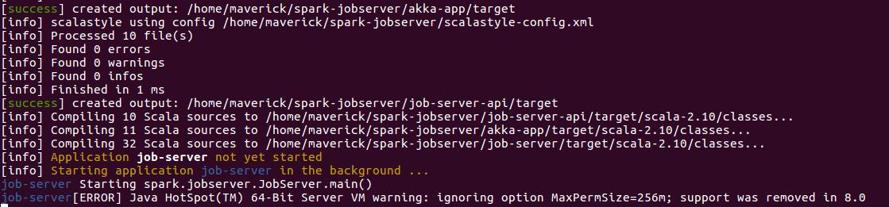

##Installing Spark Job Server

###Prerequisites

####Installing java 8
```
sudo add-apt-repository ppa:webupd8team/java
sudo apt-get update
sudo apt-get install oracle-java8-installer
java -version
```

####set java 8 as default
```
sudo update-alternatives --config java
```

###Installing sbt
```
echo "deb https://dl.bintray.com/sbt/debian /" | sudo tee -a /etc/apt/sources.list.d/sbt.list
sudo apt-key adv --keyserver hkp://keyserver.ubuntu.com:80 --recv 642AC823
sudo apt-get update
sudo apt-get install sbt
```

###Install maven
```
sudo apt install maven
```

###Installing Certificates
```
openssl genrsa -des3 -out server.key 2048
openssl req -new -key server.key -out server.csr
openssl x509 -req -days 365 -in server.csr -signkey server.key -out server.crt 

sudo cp server.crt /etc/ssl/certs/.
sudo cp server.key /etc/ssl/private/.
```

###Installing Spark
```
git clone https://github.com/apache/spark.git
cd spark
build/mvn -DskipTests clean package
```

###Installing Spark Job Server
```
git clone https://github.com/spark-jobserver/spark-jobserver.git
cd spark-jobserver
sbt
job-server/reStart
```

####Result
```
> job-server/reStart
[info] scalastyle using config /home/maverick/spark-jobserver/scalastyle-config.xml
[info] Processed 32 file(s)
[info] Found 0 errors
[info] Found 0 warnings
[info] Found 0 infos
[info] Finished in 13 ms
[success] created output: /home/maverick/spark-jobserver/job-server/target
[warn] Credentials file /home/maverick/.bintray/.credentials does not exist
[warn] Credentials file /home/maverick/.bintray/.credentials does not exist
[info] Updating {file:/home/maverick/spark-jobserver/}job-server-api...
[info] Updating {file:/home/maverick/spark-jobserver/}akka-app...
[info] Resolving org.fusesource.jansi#jansi;1.4 ...
[info] downloading https://repo1.maven.org/maven2/io/netty/netty-all/4.0.29.Final/netty-all-4.0.29.Final.jar ...
[info] 	[SUCCESSFUL ] io.netty#netty-all;4.0.29.Final!netty-all.jar (1924ms)
[info] downloading https://repo1.maven.org/maven2/org/scalactic/scalactic_2.10/2.2.6/scalactic_2.10-2.2.6.jar ...
[info] 	[SUCCESSFUL ] org.scalactic#scalactic_2.10;2.2.6!scalactic_2.10.jar(bundle) (594ms)
[info] downloading https://repo1.maven.org/maven2/org/joda/joda-convert/1.8.1/joda-convert-1.8.1.jar ...
[info] 	[SUCCESSFUL ] org.joda#joda-convert;1.8.1!joda-convert.jar (291ms)
[info] downloading https://repo1.maven.org/maven2/joda-time/joda-time/2.9.3/joda-time-2.9.3.jar ...
[info] 	[SUCCESSFUL ] joda-time#joda-time;2.9.3!joda-time.jar (1112ms)
[info] downloading https://repo1.maven.org/maven2/com/typesafe/config/1.3.0/config-1.3.0.jar ...
[info] 	[SUCCESSFUL ] com.typesafe#config;1.3.0!config.jar(bundle) (992ms)
[info] downloading https://repo1.maven.org/maven2/com/typesafe/akka/akka-cluster_2.10/2.3.15/akka-cluster_2.10-2.3.15.jar ...
[info] 	[SUCCESSFUL ] com.typesafe.akka#akka-cluster_2.10;2.3.15!akka-cluster_2.10.jar (1280ms)
[info] downloading https://repo1.maven.org/maven2/io/spray/spray-json_2.10/1.3.2/spray-json_2.10-1.3.2.jar ...
[info] 	[SUCCESSFUL ] io.spray#spray-json_2.10;1.3.2!spray-json_2.10.jar(bundle) (456ms)
[info] downloading https://repo1.maven.org/maven2/io/spray/spray-can_2.10/1.3.3/spray-can_2.10-1.3.3.jar ...
[info] 	[SUCCESSFUL ] io.spray#spray-can_2.10;1.3.3!spray-can_2.10.jar(bundle) (859ms)
[info] downloading https://repo1.maven.org/maven2/io/spray/spray-caching_2.10/1.3.3/spray-caching_2.10-1.3.3.jar ...
[info] 	[SUCCESSFUL ] io.spray#spray-caching_2.10;1.3.3!spray-caching_2.10.jar(bundle) (212ms)
[info] downloading https://repo1.maven.org/maven2/io/spray/spray-routing_2.10/1.3.3/spray-routing_2.10-1.3.3.jar ...
.
.
.
[info] Done updating.
[info] scalastyle using config /home/maverick/spark-jobserver/scalastyle-config.xml
[info] Processed 11 file(s)
[info] Found 0 errors
[info] Found 0 warnings
[info] Found 0 infos
[info] Finished in 4 ms
[success] created output: /home/maverick/spark-jobserver/akka-app/target
[info] scalastyle using config /home/maverick/spark-jobserver/scalastyle-config.xml
[info] Processed 10 file(s)
[info] Found 0 errors
[info] Found 0 warnings
[info] Found 0 infos
[info] Finished in 1 ms
[success] created output: /home/maverick/spark-jobserver/job-server-api/target
[info] Compiling 10 Scala sources to /home/maverick/spark-jobserver/job-server-api/target/scala-2.10/classes...
[info] Compiling 11 Scala sources to /home/maverick/spark-jobserver/akka-app/target/scala-2.10/classes...
[info] Compiling 32 Scala sources to /home/maverick/spark-jobserver/job-server/target/scala-2.10/classes...


```


