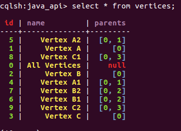

##Spark-Cassandra


###Spark-Cassandra-Connector Installation

####Clone repository

```
maverick@ubuntu:~/Desktop/repos$ git clone https://github.com/datastax/spark-cassandra-connector
```


####Build the Spark Cassandra Connector

```
maverick@ubuntu:~/Desktop/repos/spark-cassandra-connector$ ./sbt/sbt assembly
```

#####Result
```
Attempting to fetch sbt
Launching sbt from sbt/sbt-launch-0.13.8.jar
Java HotSpot(TM) 64-Bit Server VM warning: ignoring option MaxPermSize=350m; support was removed in 8.0
Getting org.scala-sbt sbt 0.13.8 ...
...

Test run finished: 0 failed, 0 ignored, 50 total, 0.227s
[info] ScalaCheck
[info] Passed: Total 0, Failed 0, Errors 0, Passed 0
[info] ScalaTest
[info] Run completed in 21 seconds, 139 milliseconds.
[info] Total number of tests run: 311
[info] Suites: completed 27, aborted 0
[info] Tests: succeeded 311, failed 0, canceled 0, ignored 4, pending 0
[info] All tests passed.
[info] Passed: Total 468, Failed 0, Errors 0, Passed 468, Ignored 4
[info] Checking every *.class/*.jar file's SHA-1.
[info] Merging files...
[warn] Merging 'META-INF/INDEX.LIST' with strategy 'last'
[warn] Merging 'META-INF/LICENSE.txt' with strategy 'last'
[warn] Merging 'META-INF/MANIFEST.MF' with strategy 'discard'
[warn] Merging 'META-INF/NOTICE.txt' with strategy 'last'
[warn] Merging 'META-INF/io.netty.versions.properties' with strategy 'last'
[warn] Strategy 'discard' was applied to a file
[warn] Strategy 'last' was applied to 4 files
[info] SHA-1: 2cee273af57a075ee387e35379586429804eb863
[info] Packaging /home/maverick/Desktop/repos/spark-cassandra-connector/spark-cassandra-connector/target/scala-2.10/spark-cassandra-connector-assembly-1.6.0-M2-25-gb476e45.jar ...
[info] Done packaging.
[success] Total time: 435 s, completed May 15, 2016 12:18:11 PM

```

###Installing Cassandra

```
https://www.digitalocean.com/community/tutorials/how-to-install-cassandra-and-run-a-single-node-cluster-on-ubuntu-14-04
```
I'll install Cassandra using packages from the official Apache Software Foundation repositories, so start by adding the repo so that the packages are available to your system. Note that Cassandra 3.0.6  released on 2016-05-13,  is the latest version at this time (20160515).

```
maverick@ubuntu:~/Desktop/repos/spark-cassandra-connector$ echo "deb http://www.apache.org/dist/cassandra/debian 30x main" | sudo tee -a /etc/apt/sources.list.d/cassandra.sources.listdeb http://www.apache.org/dist/cassandra/debian 30x main
```

To avoid package signature warnings
```
maverick@ubuntu:~/Desktop/repos/spark-cassandra-connector$ gpg --keyserver pgp.mit.edu --recv-keys F758CE318D77295D
gpg: keyring `/home/maverick/.gnupg/secring.gpg' created
gpg: keyring `/home/maverick/.gnupg/pubring.gpg' created
gpg: requesting key 8D77295D from hkp server pgp.mit.edu
gpg: /home/maverick/.gnupg/trustdb.gpg: trustdb created
gpg: key 8D77295D: public key "Eric Evans <eevans@sym-link.com>" imported
gpg: no ultimately trusted keys found
gpg: Total number processed: 1
gpg:               imported: 1  (RSA: 1)

```

Also
```
maverick@ubuntu:~/Desktop/repos/spark-cassandra-connector$ gpg --export --armor F758CE318D77295D | sudo apt-key add -
OK

```
Then add the second key:

```
maverick@ubuntu:~/Desktop/repos/spark-cassandra-connector$ gpg --keyserver pgp.mit.edu --recv-keys 2B5C1B00
gpg: requesting key 2B5C1B00 from hkp server pgp.mit.edu
gpg: key 2B5C1B00: public key "Sylvain Lebresne (pcmanus) <sylvain@datastax.com>" imported
gpg: Total number processed: 1
gpg:               imported: 1  (RSA: 1)
```

Then

```
maverick@ubuntu:~/Desktop/repos/spark-cassandra-connector$ gpg --export --armor 2B5C1B00 | sudo apt-key add -
OK
```

Update the package database:
```
maverick@ubuntu:~/Desktop/repos/spark-cassandra-connector$ sudo apt-get update

```

Finally, install Cassandra:

```
maverick@ubuntu:~/Desktop/repos/spark-cassandra-connector$ sudo apt-get install cassandra
Reading package lists... Done
Building dependency tree       
Reading state information... Done
The following additional packages will be installed:
  libopts25 ntp
Suggested packages:
  cassandra-tools ntp-doc
The following NEW packages will be installed:
  cassandra libopts25 ntp
0 upgraded, 3 newly installed, 0 to remove and 56 not upgraded.
Need to get 24.9 MB of archives.
After this operation, 34.9 MB of additional disk space will be used.
Do you want to continue? [Y/n] 
...

Get:1 http://us.archive.ubuntu.com/ubuntu xenial/main amd64 libopts25 amd64 1:5.18.7-3 [57.8 kB]
Get:3 http://us.archive.ubuntu.com/ubuntu xenial/main amd64 ntp amd64 1:4.2.8p4+dfsg-3ubuntu5 [518 kB]
Get:2 http://dl.bintray.com/apache/cassandra 30x/main amd64 cassandra all 3.0.6 [24.3 MB]
...

Selecting previously unselected package libopts25:amd64.
(Reading database ... 208241 files and directories currently installed.)
Preparing to unpack .../libopts25_1%3a5.18.7-3_amd64.deb ...
Unpacking libopts25:amd64 (1:5.18.7-3) ...
Selecting previously unselected package ntp.
Preparing to unpack .../ntp_1%3a4.2.8p4+dfsg-3ubuntu5_amd64.deb ...
Unpacking ntp (1:4.2.8p4+dfsg-3ubuntu5) ...
Selecting previously unselected package cassandra.
Preparing to unpack .../cassandra_3.0.6_all.deb ...
Unpacking cassandra (3.0.6) ...
Processing triggers for libc-bin (2.23-0ubuntu3) ...
Processing triggers for ureadahead (0.100.0-19) ...
Processing triggers for systemd (229-4ubuntu4) ...
Processing triggers for man-db (2.7.5-1) ...
Setting up libopts25:amd64 (1:5.18.7-3) ...
Setting up ntp (1:4.2.8p4+dfsg-3ubuntu5) ...
Setting up cassandra (3.0.6) ...
Adding group `cassandra' (GID 130) ...
Done.
vm.max_map_count = 1048575
net.ipv4.tcp_keepalive_time = 300
update-rc.d: warning: start and stop actions are no longer supported; falling back to defaults
Processing triggers for libc-bin (2.23-0ubuntu3) ...
Processing triggers for ureadahead (0.100.0-19) ...
Processing triggers for systemd (229-4ubuntu4) ...

```


Checking Cassandra:
```
maverick@ubuntu:~/Desktop/repos/spark-cassandra-connector$ sudo service cassandra status
 cassandra.service - LSB: distributed storage system for structured data
   Loaded: loaded (/etc/init.d/cassandra; bad; vendor preset: enabled)
   Active: active (running) since Sun 2016-05-15 12:41:20 PDT; 1min 17s ago
     Docs: man:systemd-sysv-generator(8)
   CGroup: /system.slice/cassandra.service
           └─80998 java -Xloggc:/var/log/cassandra/gc.log -XX:+UseParNewGC -XX:+UseConcMarkSweepGC -XX:+CMSParallelRemarkEnabled -XX:SurvivorRatio=8 -XX:MaxTenuringThreshold=1 -XX:CMS

May 15 12:41:20 ubuntu systemd[1]: Starting LSB: distributed storage system for structured data...
May 15 12:41:20 ubuntu systemd[1]: Started LSB: distributed storage system for structured data.

```


####Connecting to the Cluster

```
maverick@ubuntu:~/Desktop/repos/spark-cassandra-connector$ sudo nodetool status
Datacenter: datacenter1
=======================
Status=Up/Down
|/ State=Normal/Leaving/Joining/Moving
--  Address    Load       Tokens       Owns (effective)  Host ID                               Rack
UN  127.0.0.1  102.49 KB  256          100.0%            769e92e7-b312-4098-99c6-5c61c00af98a  rack1

```

####Connecting using iteractive command line:
```
maverick@ubuntu:~/Desktop/repos/spark-cassandra-connector$ cqlsh
Connected to Test Cluster at 127.0.0.1:9042.
[cqlsh 5.0.1 | Cassandra 3.0.6 | CQL spec 3.4.0 | Native protocol v4]
Use HELP for help.
cqlsh> 

```

####Using cql

#####Create a keyspace -- a namespace of tables. 
```
CREATE KEYSPACE sparkkeyspace
WITH REPLICATION = { 'class' : 'SimpleStrategy', 'replication_factor' : 1 };
```

#####Authenticate to the new keyspace: 
```
USE sparkkeyspace;
```

#####Create a users table:
```
cqlsh:sparkkeyspace> 
CREATE TABLE users (
  user_id int PRIMARY KEY,
  fname text,
  lname text
);
```

####Insert some data
```
INSERT INTO users (user_id,  fname, lname)
  VALUES (1745, 'john', 'smith');
INSERT INTO users (user_id,  fname, lname)
  VALUES (1744, 'john', 'doe');
INSERT INTO users (user_id,  fname, lname)
  VALUES (1746, 'john', 'smith');
```

####Load data that we have just inserted
```
SELECT * FROM users;
```

Your screen should look like the following:


####Using Connector from Spark Shell
```
maverick@ubuntu:~/Desktop/spark$ ./bin/spark-shell –jars ../jars/spark-cassandra-connector-assembly-1.6.0-M2-25-gb476e45.jar
Using Spark's default log4j profile: org/apache/spark/log4j-defaults.properties
Setting default log level to "WARN".
To adjust logging level use sc.setLogLevel(newLevel).
16/05/15 13:46:33 WARN NativeCodeLoader: Unable to load native-hadoop library for your platform... using builtin-java classes where applicable
16/05/15 13:46:35 WARN Utils: Your hostname, ubuntu resolves to a loopback address: 127.0.1.1; using 192.168.116.139 instead (on interface ens33)
16/05/15 13:46:35 WARN Utils: Set SPARK_LOCAL_IP if you need to bind to another address
16/05/15 13:47:38 WARN AbstractHandler: No Server set for org.spark_project.jetty.server.handler.ErrorHandler@3003e580
Spark context Web UI available at http://192.168.116.139:4040
Spark context available as 'sc' (master = local[*], app id = local-1463345265088).
Spark session available as 'spark'.
Welcome to
      ____              __
     / __/__  ___ _____/ /__
    _\ \/ _ \/ _ `/ __/  '_/
   /___/ .__/\_,_/_/ /_/\_\   version 2.0.0-SNAPSHOT
      /_/
         
Using Scala version 2.11.8 (Java HotSpot(TM) 64-Bit Server VM, Java 1.8.0_91)
Type in expressions to have them evaluated.
Type :help for more information.
```

####Configuring IDEA (Troubleshooting)
Debug Settings (Run->Debug->JUnit)
VM Options: -Xms128m -Xmx512m -XXMaxPermSize=300m -ea

```
http://stackoverflow.com/questions/35745052/apache-spark-memory-exception-error-intellij-settings
```

Use the last version, if don't then you will get errors, use the following
```
<dependency>
      <groupId>com.datastax.spark</groupId>
      <artifactId>spark-cassandra-connector-embedded_2.10</artifactId>
      <version>1.6.0-M2</version>
</dependency>

<dependency>
       <groupId>com.datastax.spark</groupId>
       <artifactId>spark-cassandra-connector-java_2.10</artifactId>
       <version>1.6.0-M1</version>            
</dependency>
```

####Connector Console
```

SLF4J: Class path contains multiple SLF4J bindings.
SLF4J: Found binding in [jar:file:/home/maverick/.m2/repository/org/slf4j/slf4j-simple/1.7.7/slf4j-simple-1.7.7.jar!/org/slf4j/impl/StaticLoggerBinder.class]
SLF4J: Found binding in [jar:file:/home/maverick/.m2/repository/org/slf4j/slf4j-log4j12/1.7.10/slf4j-log4j12-1.7.10.jar!/org/slf4j/impl/StaticLoggerBinder.class]
SLF4J: See http://www.slf4j.org/codes.html#multiple_bindings for an explanation.
SLF4J: Actual binding is of type [org.slf4j.impl.SimpleLoggerFactory]
[main] INFO org.apache.spark.SparkContext - Running Spark version 1.6.1
[main] WARN org.apache.hadoop.util.NativeCodeLoader - Unable to load native-hadoop library for your platform... using builtin-java classes where applicable
[main] WARN org.apache.spark.util.Utils - Your hostname, ubuntu resolves to a loopback address: 127.0.1.1; using 192.168.116.139 instead (on interface ens33)
[main] WARN org.apache.spark.util.Utils - Set SPARK_LOCAL_IP if you need to bind to another address
[main] INFO org.apache.spark.SecurityManager - Changing view acls to: maverick
[main] INFO org.apache.spark.SecurityManager - Changing modify acls to: maverick
[main] INFO org.apache.spark.SecurityManager - SecurityManager: authentication disabled; ui acls disabled; users with view permissions: Set(maverick); users with modify permissions: Set(maverick)
[main] INFO org.apache.spark.util.Utils - Successfully started service 'sparkDriver' on port 44157.
[sparkDriverActorSystem-akka.actor.default-dispatcher-2] INFO akka.event.slf4j.Slf4jLogger - Slf4jLogger started
[sparkDriverActorSystem-akka.actor.default-dispatcher-4] INFO Remoting - Starting remoting
[sparkDriverActorSystem-akka.actor.default-dispatcher-4] INFO Remoting - Remoting started; listening on addresses :[akka.tcp://sparkDriverActorSystem@192.168.116.139:36469]
[main] INFO org.apache.spark.util.Utils - Successfully started service 'sparkDriverActorSystem' on port 36469.
[main] INFO org.apache.spark.SparkEnv - Registering MapOutputTracker
[main] INFO org.apache.spark.SparkEnv - Registering BlockManagerMaster
[main] INFO org.apache.spark.storage.DiskBlockManager - Created local directory at /tmp/blockmgr-85143101-36f8-4d01-9357-83b4d385ac71
[main] INFO org.apache.spark.storage.MemoryStore - MemoryStore started with capacity 116.6 MB
[main] INFO org.apache.spark.SparkEnv - Registering OutputCommitCoordinator
[main] INFO org.spark-project.jetty.server.Server - jetty-8.y.z-SNAPSHOT
[main] INFO org.spark-project.jetty.server.AbstractConnector - Started SelectChannelConnector@0.0.0.0:4040
[main] INFO org.apache.spark.util.Utils - Successfully started service 'SparkUI' on port 4040.
[main] INFO org.apache.spark.ui.SparkUI - Started SparkUI at http://192.168.116.139:4040
[main] INFO org.apache.spark.executor.Executor - Starting executor ID driver on host localhost
[main] INFO org.apache.spark.util.Utils - Successfully started service 'org.apache.spark.network.netty.NettyBlockTransferService' on port 40011.
[main] INFO org.apache.spark.network.netty.NettyBlockTransferService - Server created on 40011
[main] INFO org.apache.spark.storage.BlockManagerMaster - Trying to register BlockManager
[dispatcher-event-loop-0] INFO org.apache.spark.storage.BlockManagerMasterEndpoint - Registering block manager localhost:40011 with 116.6 MB RAM, BlockManagerId(driver, localhost, 40011)
[main] INFO org.apache.spark.storage.BlockManagerMaster - Registered BlockManager
[main] INFO com.datastax.driver.core.NettyUtil - Found Netty's native epoll transport in the classpath, using it
[main] INFO com.datastax.driver.core.Cluster - New Cassandra host /192.168.116.139:9042 added
[main] INFO com.datastax.spark.connector.cql.CassandraConnector - Connected to Cassandra cluster: Test Cluster
```
####Errors:
```
[main] INFO com.datastax.driver.core.Cluster - New Cassandra host /192.168.116.139:9042 added
[main] INFO com.datastax.spark.connector.cql.CassandraConnector - Connected to Cassandra cluster: Test Cluster
Exception in thread "main" java.lang.NoClassDefFoundError: org/apache/spark/sql/catalyst/package$ScalaReflectionLock$
	at org.apache.spark.sql.catalyst.ReflectionLock$.<init>(ReflectionLock.scala:5)
	at org.apache.spark.sql.catalyst.ReflectionLock$.<clinit>(ReflectionLock.scala)
	at com.datastax.spark.connector.mapper.ReflectionColumnMapper.<init>(ReflectionColumnMapper.scala:38)
```

I solved this including:
```
	<dependency>
            <groupId>org.apache.spark</groupId>
            <artifactId>spark-catalyst_2.10</artifactId>
            <version>${spark.version}</version>
        </dependency>
```

```
Exception in thread "main" java.lang.NoClassDefFoundError: org/apache/spark/sql/DataFrame
	at java.lang.Class.getDeclaredMethods0(Native Method)
	at java.lang.Class.privateGetDeclaredMethods(Class.java:2701)
	at java.lang.Class.getDeclaredMethod(Class.java:2128)
```

Solved with:

```
http://stackoverflow.com/questions/34871015/exception-in-thread-main-java-lang-noclassdeffounderror-org-apache-spark-sql
```

```
        <dependency>
            <groupId>org.apache.spark</groupId>
            <artifactId>spark-sql_2.10</artifactId>
            <version>${spark.version}</version>
        </dependency>
```

####Connector running successfully should look like this:
```
SLF4J: Class path contains multiple SLF4J bindings.
SLF4J: Found binding in [jar:file:/home/maverick/.m2/repository/org/slf4j/slf4j-simple/1.7.7/slf4j-simple-1.7.7.jar!/org/slf4j/impl/StaticLoggerBinder.class]
SLF4J: Found binding in [jar:file:/home/maverick/.m2/repository/org/slf4j/slf4j-log4j12/1.7.10/slf4j-log4j12-1.7.10.jar!/org/slf4j/impl/StaticLoggerBinder.class]
SLF4J: See http://www.slf4j.org/codes.html#multiple_bindings for an explanation.
SLF4J: Actual binding is of type [org.slf4j.impl.SimpleLoggerFactory]
[main] INFO org.apache.spark.SparkContext - Running Spark version 1.6.1
[main] WARN org.apache.hadoop.util.NativeCodeLoader - Unable to load native-hadoop library for your platform... using builtin-java classes where applicable
[main] WARN org.apache.spark.util.Utils - Your hostname, ubuntu resolves to a loopback address: 127.0.1.1; using 192.168.116.139 instead (on interface ens33)
[main] WARN org.apache.spark.util.Utils - Set SPARK_LOCAL_IP if you need to bind to another address
[main] INFO org.apache.spark.SecurityManager - Changing view acls to: maverick
[main] INFO org.apache.spark.SecurityManager - Changing modify acls to: maverick
[main] INFO org.apache.spark.SecurityManager - SecurityManager: authentication disabled; ui acls disabled; users with view permissions: Set(maverick); users with modify permissions: Set(maverick)
[main] INFO org.apache.spark.util.Utils - Successfully started service 'sparkDriver' on port 45204.
[sparkDriverActorSystem-akka.actor.default-dispatcher-5] INFO akka.event.slf4j.Slf4jLogger - Slf4jLogger started
[sparkDriverActorSystem-akka.actor.default-dispatcher-5] INFO Remoting - Starting remoting
[sparkDriverActorSystem-akka.actor.default-dispatcher-5] INFO Remoting - Remoting started; listening on addresses :[akka.tcp://sparkDriverActorSystem@192.168.116.139:38490]
[main] INFO org.apache.spark.util.Utils - Successfully started service 'sparkDriverActorSystem' on port 38490.
[main] INFO org.apache.spark.SparkEnv - Registering MapOutputTracker
[main] INFO org.apache.spark.SparkEnv - Registering BlockManagerMaster
[main] INFO org.apache.spark.storage.DiskBlockManager - Created local directory at /tmp/blockmgr-4fb1038d-a179-425c-a58d-4ffe48418f07
[main] INFO org.apache.spark.storage.MemoryStore - MemoryStore started with capacity 116.6 MB
[main] INFO org.apache.spark.SparkEnv - Registering OutputCommitCoordinator
[main] INFO org.spark-project.jetty.server.Server - jetty-8.y.z-SNAPSHOT
[main] INFO org.spark-project.jetty.server.AbstractConnector - Started SelectChannelConnector@0.0.0.0:4040
[main] INFO org.apache.spark.util.Utils - Successfully started service 'SparkUI' on port 4040.
[main] INFO org.apache.spark.ui.SparkUI - Started SparkUI at http://192.168.116.139:4040
[main] INFO org.apache.spark.executor.Executor - Starting executor ID driver on host localhost
[main] INFO org.apache.spark.util.Utils - Successfully started service 'org.apache.spark.network.netty.NettyBlockTransferService' on port 42599.
[main] INFO org.apache.spark.network.netty.NettyBlockTransferService - Server created on 42599
[main] INFO org.apache.spark.storage.BlockManagerMaster - Trying to register BlockManager
[dispatcher-event-loop-0] INFO org.apache.spark.storage.BlockManagerMasterEndpoint - Registering block manager localhost:42599 with 116.6 MB RAM, BlockManagerId(driver, localhost, 42599)
[main] INFO org.apache.spark.storage.BlockManagerMaster - Registered BlockManager
[main] INFO com.datastax.driver.core.NettyUtil - Found Netty's native epoll transport in the classpath, using it
[main] INFO com.datastax.driver.core.Cluster - New Cassandra host /192.168.116.139:9042 added
[main] INFO com.datastax.spark.connector.cql.CassandraConnector - Connected to Cassandra cluster: Test Cluster
[main] INFO org.apache.spark.SparkContext - Starting job: runJob at RDDFunctions.scala:37
[dag-scheduler-event-loop] INFO org.apache.spark.scheduler.DAGScheduler - Got job 0 (runJob at RDDFunctions.scala:37) with 2 output partitions
[dag-scheduler-event-loop] INFO org.apache.spark.scheduler.DAGScheduler - Final stage: ResultStage 0 (runJob at RDDFunctions.scala:37)
[dag-scheduler-event-loop] INFO org.apache.spark.scheduler.DAGScheduler - Parents of final stage: List()
[dag-scheduler-event-loop] INFO org.apache.spark.scheduler.DAGScheduler - Missing parents: List()
[dag-scheduler-event-loop] INFO org.apache.spark.scheduler.DAGScheduler - Submitting ResultStage 0 (ParallelCollectionRDD[0] at parallelize at Connector.java:72), which has no missing parents
[dag-scheduler-event-loop] INFO org.apache.spark.storage.MemoryStore - Block broadcast_0 stored as values in memory (estimated size 11.0 KB, free 11.0 KB)
[dag-scheduler-event-loop] INFO org.apache.spark.storage.MemoryStore - Block broadcast_0_piece0 stored as bytes in memory (estimated size 5.0 KB, free 16.0 KB)
[dispatcher-event-loop-0] INFO org.apache.spark.storage.BlockManagerInfo - Added broadcast_0_piece0 in memory on localhost:42599 (size: 5.0 KB, free: 116.6 MB)
[dag-scheduler-event-loop] INFO org.apache.spark.SparkContext - Created broadcast 0 from broadcast at DAGScheduler.scala:1006
[dag-scheduler-event-loop] INFO org.apache.spark.scheduler.DAGScheduler - Submitting 2 missing tasks from ResultStage 0 (ParallelCollectionRDD[0] at parallelize at Connector.java:72)
[dag-scheduler-event-loop] INFO org.apache.spark.scheduler.TaskSchedulerImpl - Adding task set 0.0 with 2 tasks
[dispatcher-event-loop-1] INFO org.apache.spark.scheduler.TaskSetManager - Starting task 0.0 in stage 0.0 (TID 0, localhost, partition 0,PROCESS_LOCAL, 2575 bytes)
[dispatcher-event-loop-1] INFO org.apache.spark.scheduler.TaskSetManager - Starting task 1.0 in stage 0.0 (TID 1, localhost, partition 1,PROCESS_LOCAL, 2566 bytes)
[Executor task launch worker-0] INFO org.apache.spark.executor.Executor - Running task 0.0 in stage 0.0 (TID 0)
[Executor task launch worker-1] INFO org.apache.spark.executor.Executor - Running task 1.0 in stage 0.0 (TID 1)
[Executor task launch worker-1] INFO com.datastax.spark.connector.writer.TableWriter - Wrote 5 rows to java_api.vertices in 0.219 s.
[Executor task launch worker-0] INFO com.datastax.spark.connector.writer.TableWriter - Wrote 5 rows to java_api.vertices in 0.228 s.
[Executor task launch worker-1] INFO org.apache.spark.executor.Executor - Finished task 1.0 in stage 0.0 (TID 1). 1864 bytes result sent to driver
[Executor task launch worker-0] INFO org.apache.spark.executor.Executor - Finished task 0.0 in stage 0.0 (TID 0). 1864 bytes result sent to driver
[task-result-getter-0] INFO org.apache.spark.scheduler.TaskSetManager - Finished task 1.0 in stage 0.0 (TID 1) in 369 ms on localhost (1/2)
[task-result-getter-1] INFO org.apache.spark.scheduler.TaskSetManager - Finished task 0.0 in stage 0.0 (TID 0) in 401 ms on localhost (2/2)
[task-result-getter-1] INFO org.apache.spark.scheduler.TaskSchedulerImpl - Removed TaskSet 0.0, whose tasks have all completed, from pool 
[dag-scheduler-event-loop] INFO org.apache.spark.scheduler.DAGScheduler - ResultStage 0 (runJob at RDDFunctions.scala:37) finished in 0.411 s
[main] INFO org.apache.spark.scheduler.DAGScheduler - Job 0 finished: runJob at RDDFunctions.scala:37, took 0.782670 s
```

The following query on cql should look like the following:




###References
* [1] http://wiki.apache.org/cassandra/GettingStarted
* [2] https://chongyaorobin.wordpress.com/2015/07/16/step-by-step-of-how-to-configure-apache-spark-to-connect-with-cassandra/
* [3] [Step by Step of Building Scala SBT project on Intellij] https://chongyaorobin.wordpress.com/2015/07/01/hello-world/
* [4] [Step by Step of installing Apache Cassandra on Ubuntu Standalone mode] https://chongyaorobin.wordpress.com/2015/07/08/step-by-step-of-installing-apache-cassandra-on-ubuntu/
* [5] http://stackoverflow.com/questions/25837436/how-to-load-spark-cassandra-connector-in-the-shell
* [6] http://stackoverflow.com/questions/26221860/compilation-errors-with-spark-cassandra-connector-and-sbt
* [7] https://mail-archives.apache.org/mod_mbox/spark-user/201506.mbox/%3CCAM2quyFZ1BQw7hAf0yuJqp0kdtFA7+eWarg3p3225-r4U0rQ7w@mail.gmail.com%3E
* [8] [Accessing Cassandra from Spark in Java] http://www.datastax.com/dev/blog/accessing-cassandra-from-spark-in-java
* [9] [Error] http://stackoverflow.com/questions/16783725/error-while-connecting-to-cassandra-using-java-driver-for-apache-cassandra-1-0-f
* [10] [REAL-TIME DATA ANALYSIS USING SPARK] http://blog.scottlogic.com/2013/07/29/spark-stream-analysis.html
* [11] [Spark-Java-Maven] http://sparkjava.com/documentation.html
* [12] https://github.com/datastax/spark-cassandra-connector
* [12] https://github.com/datastax/spark-cassandra-connector/blob/master/doc/7_java_api.md
* [12] https://github.com/datastax/spark-cassandra-connector/blob/master/doc/5_saving.md
* [13] http://ampcamp.berkeley.edu/big-data-mini-course/graph-analytics-with-graphx.html
* [14] [slides] http://koeninger.github.io/spark-cassandra-example/#14
* [15] http://www.slideshare.net/patrickmcfadin/analyzing-time-series-data-with-apache-spark-and-cassandra
* [16] https://github.com/datastax/java-driver/blob/3.0/driver-examples/stress/src/main/java/com/datastax/driver/stress/Stress.java
* [17] https://github.com/datastax/spark-cassandra-connector/blob/master/doc/8_streaming.md
* [18] [Good Java Example] https://gist.github.com/jacek-lewandowski/278bfc936ca990bee35a
* [19] The difference between Titan graph database and Apache Spark’s GraphX http://www.sitelabs.com/?p=14
* [20] http://www.planetcassandra.org/blog/kindling-an-introduction-to-spark-with-cassandra/
* [21] [Documentation] https://spark.apache.org/docs/1.1.0/api/scala/index.html#org.apache.spark.graphx.lib.ConnectedComponents$
* [22] https://databricks-training.s3.amazonaws.com/graph-analytics-with-graphx.html


####how to create EdgeRDD from data frame in Spark
* https://stackoverflow.com/questions/34135288/how-to-create-edgerdd-from-data-frame-in-spark


